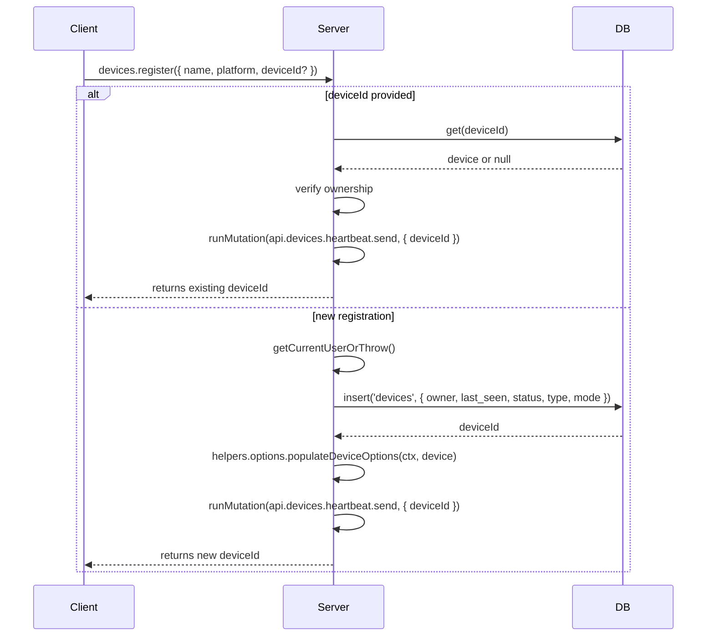
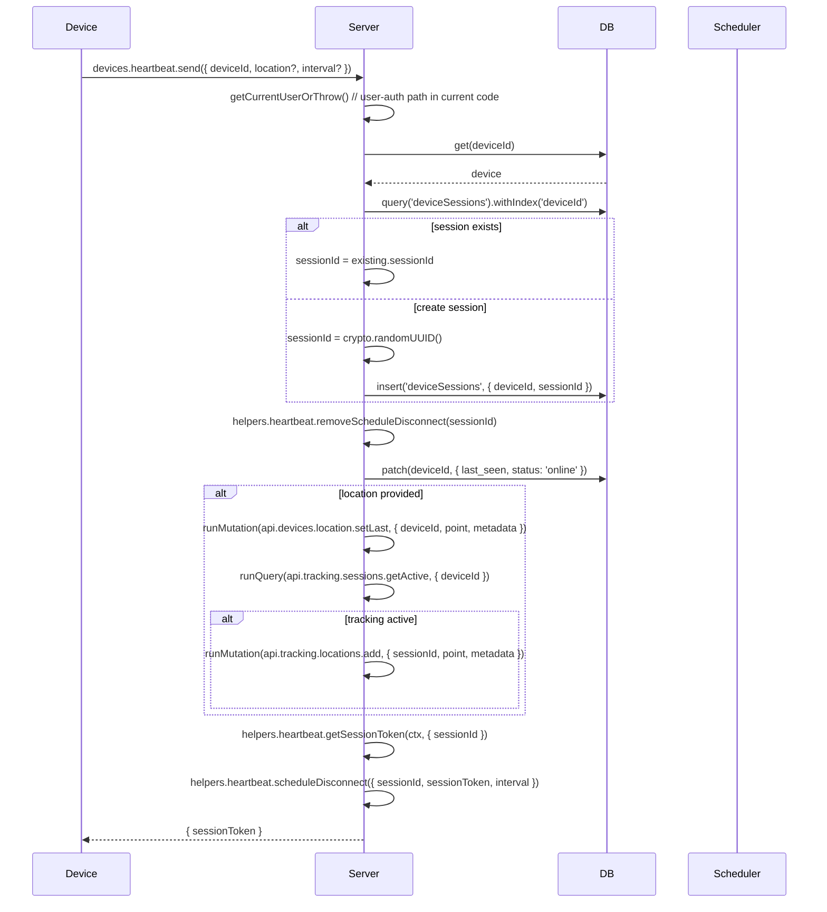
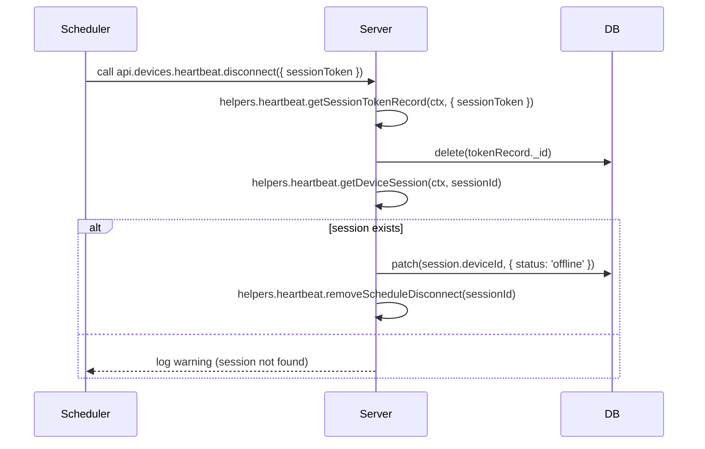
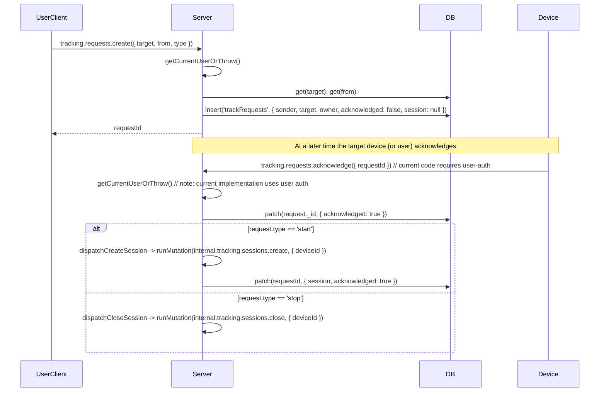

This page diagrams the current live flows implemented in the Convex codebase (files under `packages/backend/convex`). These are the flows you can compare against the POC design.

Notes: the diagrams are derived from the following server files (live code):
- `packages/backend/convex/devices/manage.ts` (register / unregister)
- `packages/backend/convex/devices/heartbeat.ts` (heartbeat send / disconnect)
- `packages/backend/convex/lib/devices/heartbeat.ts` (scheduler helpers, token helpers)
- `packages/backend/convex/tracking/requests.ts` (requests.create / acknowledge)
- `packages/backend/convex/tracking/sessions.ts` (session create / close)

## 1) Device registration (current)

Notes: registration requires user-auth (via `getCurrentUserOrThrow`) and bootstraps the device record. It triggers an initial `heartbeat.send` for convenience.

## 2) Heartbeat flow (current)

Notes: the current server expects user-auth for `heartbeat.send` (via `getCurrentUserOrThrow`) and then creates/refreshes a session, returns a `sessionToken`, and schedules a disconnect.

## 3) Scheduled disconnect (current)

Notes: scheduled disconnects are implemented with Convex scheduler (`ctx.scheduler.runAfter`) and store the scheduledFunction id in `deviceSessionTimeouts`.

## 4) Request / Acknowledge (current)

Notes: `requests.acknowledge` currently requires a user-authenticated caller in the code; the plan is to allow device-auth (sessionToken) for this flow in the POC design.
