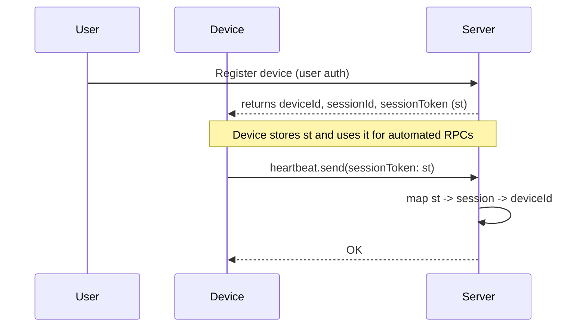

## Goals and constraints

- Fast POC: accept `sessionToken` as an RPC parameter (instead of headers) for device-authenticated calls.
- Keep server-side validation authoritative: token -> deviceSession -> deviceId mapping.
- Preserve current UX: devices are registered by users; sessions persist until user unregisters device.
- Keep changes additive and minimal: extend existing tables and add helpers.

## Proposed new/extended schema (Convex validators)

Add or extend the following tables in `convex/schemas`:

```ts
// deviceSecrets: optional long-lived secret (hashed) for each device
export const deviceSecrets = defineTable({
  deviceId: v.id('devices'),
  // store a hashed secret (argon2/bcrypt) or opaque identifier
  secretHash: v.string(),
  createdBy: v.id('users'),
  createdAt: v.number(),
}).index('by_device', ['deviceId'])

// extend deviceSessionTokens with audit/rotation fields
export const deviceSessionTokens = defineTable({
  token: v.string(),
  sessionId: v.string(),
  revoked: v.optional(v.boolean()),
  lastUsedAt: v.optional(v.number()),
  issuedBy: v.optional(v.id('users')),
}).index('token', ['token']).index('sessionId', ['sessionId'])
```

Notes:

- `deviceSecrets` is optional for the POC: if present, can be used to re-issue tokens or rotate tokens securely.


## Helper contracts (Type-level)

- Note: the `helpers` object exported from `packages/backend/convex/lib/devices` already exposes functions we can reuse:

- `helpers.heartbeat.getSessionTokenRecord(ctx, { sessionToken })` — lookup token records
- `helpers.heartbeat.getDeviceSession(ctx, sessionId)` — lookup sessions

Thin wrappers we can add (in `lib/auth` or `lib/devices`) to centralize auth behavior:

- `getSessionByToken(ctx, token)` → `{ session, tokenRecord } | null`
- `requireSessionByToken(ctx, token)` → throws if invalid
- `createSessionToken(ctx, sessionId)` / `revokeSessionToken(ctx, token)` / `rotateSessionToken(ctx, oldToken)`

Pseudocode for `getSessionByToken`:

```ts
export async function getSessionByToken(ctx, token) {
  const tokenRecord = await ctx.db
    .query('deviceSessionTokens')
    .withIndex('token', (q) => q.eq('token', token))
    .unique()
  if (!tokenRecord || tokenRecord.revoked) return null
  const session = await ctx.db
    .query('deviceSessions')
    .withIndex('sessionId', (q) => q.eq('sessionId', tokenRecord.sessionId))
    .unique()
  if (!session) return null
  return { session, tokenRecord }
}
```

## RPC adaptation examples

heartbeat.send (accept sessionToken):

```ts
// args: { deviceId?: Id<'devices'>, sessionToken?: string, interval?, location? }
if (args.sessionToken) {
  const auth = await helpers.heartbeat.getSessionByToken(ctx, args.sessionToken)
  if (!auth) throw new Error('Invalid session token')
  const deviceId = auth.session.deviceId
  // update token lastUsedAt
  await ctx.db.patch(auth.tokenRecord._id, { lastUsedAt: Date.now() })
  // continue as before using deviceId
}
```

### Token generation (POC)

For token generation we can use `nanoid` for a compact secure random string. Example:

```ts
import { nanoid } from 'nanoid'

function createSessionToken() {
  // 48-char token
  return nanoid(48)
}
```

Using `nanoid` avoids introducing heavier crypto deps and provides sufficiently long entropy for our use case.

requests.acknowledge (allow sessionToken):

```ts
// existing: requires getCurrentUserOrThrow and checks ownership
// new path:
if (args.sessionToken) {
  const auth = await helpers.heartbeat.getSessionByToken(ctx, args.sessionToken)
  if (!auth) throw new Error('Invalid session token')
  // ensure the request target equals auth.session.deviceId
  const request = await ctx.db.get(requestId)
  if (request.target !== auth.session.deviceId) throw new Error('Unauthorized')
  // proceed with acknowledgement flow as if performed by the device
}
```

## Security considerations (for POC and next steps)

- Store `deviceSecrets.secretHash` with a strong password hash. Avoid storing plaintext secrets.
- Use HTTPS for all device communications.
- Consider rotating session tokens periodically and supporting a refresh flow.
- Audit token creation, rotation and revocation.

## Operational notes

- On `unregister` flow: delete `deviceSecrets`, delete all `deviceSessionTokens` for device sessions, cancel scheduled `deviceSessionTimeouts`, and optionally close `deviceSessions`.
- Add a periodic job (cron) to clean orphaned tokens/sessions if the user cleanup isn't run.

## Flow diagram: token issuance and use



## Questions / Decisions for you

1. Token format: use a secure random string for POC (we recommend `nanoid(48)`) or move to signed tokens (HMAC/JWT) later if needed.
2. Rotation policy: automatic rotation interval (e.g., 90 days) or manual rotation only? (Recommend manual for POC.)
3. Should tokens be allowed to be multiple per session/device (to support multiple devices/clients) or single? (Recommend multiple tokens per session to support repeated provisioning.)

If you want, I can implement the helper functions and the minimal RPC changes as a follow-up PR/prototype.
