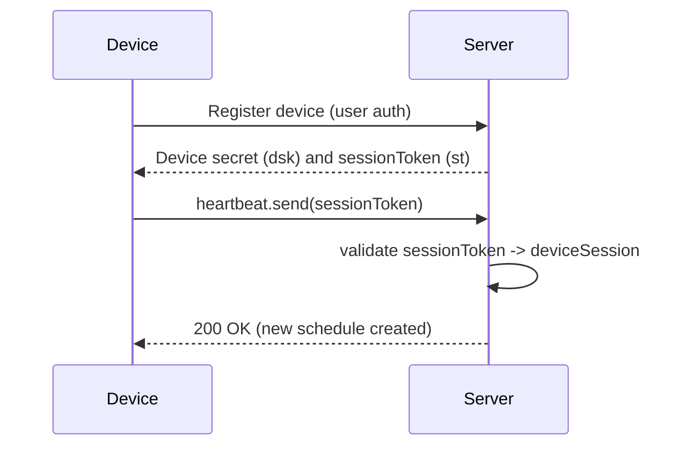
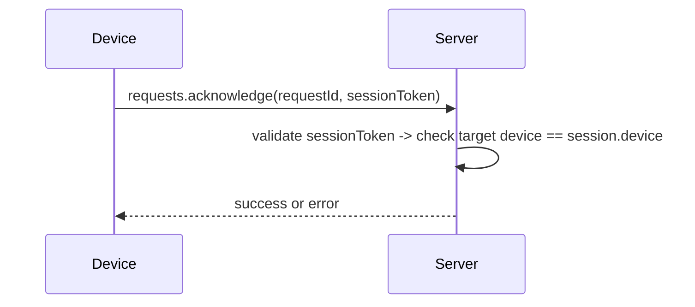

## Lifecycle Overview

Devices may be provisioned with a device secret (DSK) at registration time, but DSK is optional for the POC. The server will issue session tokens (independently generated, e.g. `nanoid(48)`) and return them to the device to use for subsequent RPCs.

Key concepts:

- Device secret (dsk): long-lived per-device secret stored server-side and optionally on the device at provisioning. Treated like a password.
- Session token (st): bearer token (opaque string) returned to the device and used for automated RPCs. Mapped to a server-side `deviceSession` entry.
- Scheduled disconnect: the scheduler uses the token to disconnect stale sessions.

### Flow: Provision → Heartbeat

### Flow: Acknowledge request (hybrid)

### Token lifetime / revocation rules

- Session tokens are long-lived in the POC and only removed when device is unregistered or explicitly revoked.
- Rotation: we defer automatic rotation for now; rotation can be implemented later as a manual or server-driven process.
- Revocation: when user unregisters the device, the server should delete device secrets (if any), session tokens, scheduled timeouts, and session records.

### DB artifacts involved

- `devices` (existing): device metadata and owner
- `deviceSessions` (existing): maps active sessions to `deviceId` and `sessionId`
-- `deviceSessionTokens` (existing): token ↔ sessionId mapping (add fields: `revoked`, `lastUsedAt`, `issuedBy`) 

Note: use Convex's `_creationTime` for issued timestamps unless you need client-provided times.
- `deviceSessionTimeouts` (existing): scheduled disconnects

Suggested change: extend `deviceSessionTokens` with metadata fields for audit and rotation.
