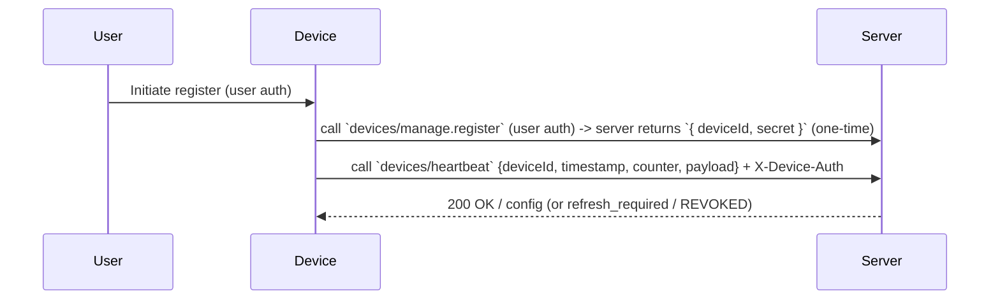
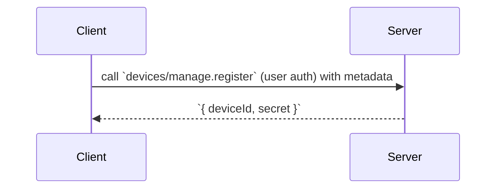
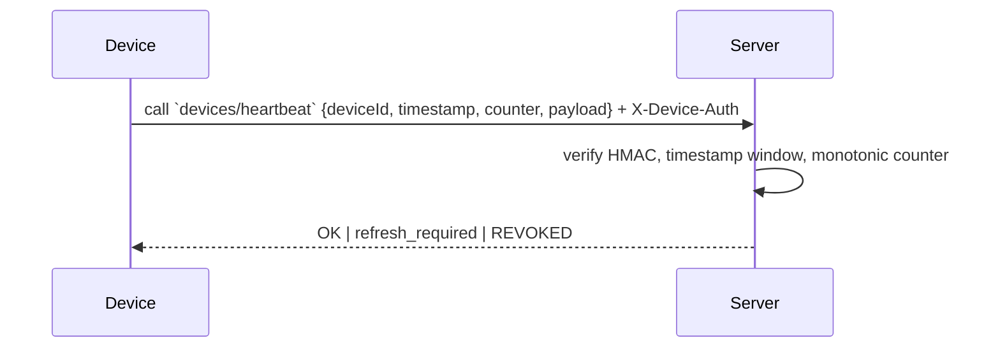
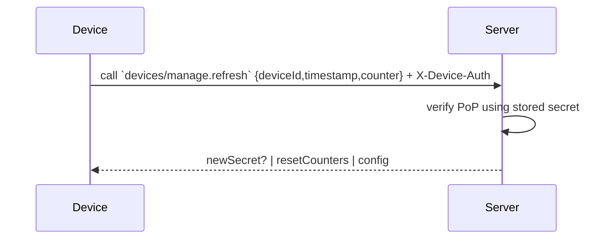

## Summary and decisions

This document is the canonical design and implementation plan for the machine-to-machine (M2M) device authentication proof-of-concept for this repository. Decisions are final for the PoC (we will revisit and replace pieces later when moving to production). The implementation and runtime will live in `packages/backend/convex` and be imported by client apps; the client code is only responsible for storing the secret securely and computing the HMAC per-message.

Decisions (PoC):

- Decision: Use server-issued per-device symmetric secrets (for PoC). These will be random tokens (existing `nanoid(48)` tokens are acceptable for PoC). Treat them as long-lived secrets that the server can rotate or revoke.
- Decision: Use per-message HMAC authentication with a canonicalized string: `deviceId|timestamp|counter|payload`.
- Decision: Do not rely on short-lived time-based tokens for heartbeat authentication in PoC — heartbeats must work after long offline periods. Optional short-lived tokens may be introduced later for convenience when device is online.
- Decision: Server is authoritative. Every request must be validated against the server-side device record for status, revocation, and counter enforcement.

## One-line contract

Server issues secret -> device stores secret -> device signs each heartbeat/request -> server verifies signature, freshness and monotonic counter -> server can revoke/rotate secret.

## Responsibilities (Server vs Client)

### Server (packages/backend/convex)

- Will store device records and secrets in Convex: a device record contains `deviceId`, `secretHash`, `ownerUserId`, `status`, `lastSeen`, `lastCounter`.
- Will expose and implement the following procedures and endpoints under the `convex` package (existing files to extend):
	- `devices/manage.ts` (register, revoke, rotate)
	- `devices/heartbeat.ts` (verify and process heartbeats)
	- `lib/auth/index.ts` (helpers for HMAC verification, canonicalization, constant-time compare)
	- `devices/get.ts`, `devices/location.ts`, `devices/options.ts` (use device context once middleware attaches device)
- Will implement middleware/wrapper for Convex procedures to parse `X-Device-Auth`, validate the HMAC, and attach `device` to procedure context. This middleware lives in `packages/backend/convex/lib/auth/index.ts` and will be imported by device procedures.
- Will provide `POST /device/register` (procedure under user auth) returning `{ deviceId, secret }` once; `POST /device/refresh` to support refresh and rotation flows.
- Will maintain audit logs for register/rotate/revoke actions and failed auth attempts.

### Client (web/native/headless)

- Will store the provided `secret` securely:
	- Web PoC: `localStorage` (temporary)
	- Mobile PoC: SecureStore / Keychain
- For each device-originated request (heartbeat, location, etc.) the client will:
	- Compute `timestamp` (unix seconds or ms) and increment `counter` (monotonic integer persisted locally).
	- Canonicalize payload (stable JSON ordering) and compute HMAC over: ```${deviceId}|${timestamp}|${counter}|${payload}``` using the stored secret.
	- Send the request body including `deviceId`, `timestamp`, `counter`, `payload`, and set header `X-Device-Auth: DeviceHMAC <base64(hmac)>`.
- The client will treat secret rotation as a server-driven event: server responses may include `refresh_required` or a new secret. On `refresh_required`, the client calls `POST /device/refresh` authenticated with the same HMAC and replaces the stored secret if the server returns a new one.

## Canonicalization & signed fields

Signed string (finalized):

```
`${deviceId}|${timestamp}|${counter}|${canonicalizedPayload}`
```

- `timestamp`: unix seconds (ms optional). Server accepts ±5–10 minutes skew.
- `counter`: strictly monotonic per-device. Server rejects messages with `counter <= lastCounter`.
- `canonicalizedPayload`: deterministically ordered JSON with only required fields (minimize size for constrained devices).

## Flows (mermaid)



### Registration (detailed)



### Heartbeat / Data (detailed)



### Refresh / Rotation



## Types (AutoTypeTable)
### Device Record
<AutoTypeTable
name="DeviceRecord"
type={`export type DeviceRecord = {
	deviceId: string;
	secretHash: string; // store hashed/pepered secret
	ownerUserId: string;
	status: 'ACTIVE' | 'REVOKED';
	lastSeen?: string;
	lastCounter?: number;
}`} />
### Device Heartbeat
<AutoTypeTable
name="DeviceHeartbeat"
type={`export type DeviceHeartbeat = {
	deviceId: string;
	timestamp: string;
	counter: number;
	payload: Record<string, any>;
	signature: string; // base64 HMAC
}`}
/>

## Implementation snippets (pure functions, to copy into `packages/backend/convex/lib/auth`)

```ts
// Client-side: create HMAC signature (PoC)
function createSignature(secret: string, deviceId: string, timestamp: string, counter: number, payload: string) {
	const msg = `${deviceId}|${timestamp}|${counter}|${payload}`;
	return hmacSha256Base64(secret, msg);
}

// Server-side: verify incoming request (PoC)
function verifyDeviceRequest(deviceId: string, timestamp: string, counter: number, payload: string, signature: string) {
	const device = db.getDevice(deviceId);
	if (!device || device.status !== 'ACTIVE') throw new Error('401');
	// timestamp window check
	if (!isTimestampFresh(timestamp)) throw new Error('401-freshness');
	// monotonic counter check
	if (counter <= (device.lastCounter ?? 0)) throw new Error('409-replay');
	const expected = hmacSha256Base64(device.secret, `${deviceId}|${timestamp}|${counter}|${payload}`);
	if (!constantTimeCompare(expected, signature)) throw new Error('401-bad-signature');
	// on success update lastCounter & lastSeen
	db.updateDevice(deviceId, { lastCounter: counter, lastSeen: Date.now().toString() });
	return true;
}
```

## API surface (finalized for PoC)

- `devices/manage.register` (requires user auth) -> returns `{ deviceId, secret }` (one-time secret)
- `devices/heartbeat` (device-originated callable procedure) -> expects `{ deviceId, timestamp, counter, payload }` + `X-Device-Auth` header
- `devices/manage.refresh` (device-originated callable) -> verify PoP and optionally return a new secret or reset counters
- Admin: `devices/manage.revoke`, `devices/manage.rotate`

## Operational rules & edge cases (mandated for PoC)

1. Timestamp skew: Accept ±5 minutes by default.
2. Counters: Server must reject non-increasing counters and return `409-replay` to the device.
3. Revocation: `status = 'REVOKED'` causes immediate rejection and a message to the client that re-provisioning is required.
4. Rotation: Server may mark secrets `retired` and allow a short grace window (configurable) for in-flight messages; prefer immediate rejection in production.
5. Detection: Flag concurrent use of the same secret from geographically distant IPs and auto-suspend the device for review.

## Where to find code to extend

Start here:

- `packages/backend/convex/lib/auth/index.ts` — implement canonicalization, verify helpers, middleware wrapper.
- `packages/backend/convex/devices/heartbeat.ts` — actual heartbeat proc (already exists; extend to call the new auth helpers).
- `packages/backend/convex/devices/manage.ts` — registration, refresh, rotate, revoke.

## PoC acceptance criteria

- Devices can be registered under a user and receive a secret.
- Device heartbeats authenticated via `X-Device-Auth` are accepted and processed by `devices/heartbeat`.
- Server enforces timestamp freshness and monotonic counters and records `lastSeen`.
- Admin can revoke/rotate secrets and revoked devices are rejected.
